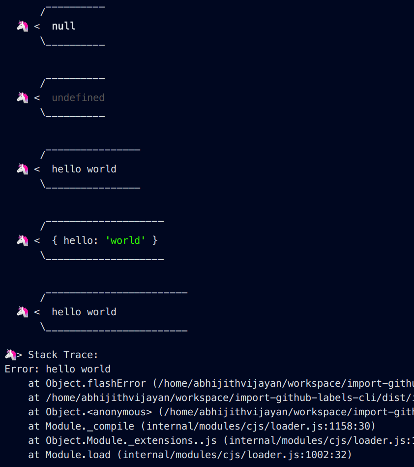

<h1 align="center">emoji-log</h1>
<p align="center">Log to console with emojis 🦄</p>
<div align="center">
  <a href="https://www.npmjs.com/package/emoji-log">
    
  </a>
  <a href="https://travis-ci.com/abhijithvijayan/emoji-log">
    
  </a>
  </a>
  <a href="https://david-dm.org/abhijithvijayan/emoji-log">
    
  </a>
  <a href="https://github.com/abhijithvijayan/emoji-log/blob/master/license">
    
  </a>
  <a href="https://twitter.com/intent/tweet?text=Check%20out%20emoji-log%21%20by%20%40_abhijithv%0A%0ALog%20to%20console%20with%20emojis%20🦄%0Ahttps%3A%2F%2Fgithub.com%2Fabhijithvijayan%2Femoji-log%0A%0A%23console%20%23javascript%20%23typescript%20%23emoji%20%23npm">
     
  </a>
</div>
<h3 align="center">🙋‍♂️ Made by <a href="https://twitter.com/_abhijithv">@abhijithvijayan</a></h3>
<p align="center">
  Donate:
  <a href="https://www.paypal.me/iamabhijithvijayan" target='_blank'><i><b>PayPal</b></i></a>,
  <a href="https://www.patreon.com/abhijithvijayan" target='_blank'><i><b>Patreon</b></i></a>
</p>
<p align="center">
  <a href='https://www.buymeacoffee.com/abhijithvijayan' target='_blank'>
    
  </a>
</p>
<hr />

❤️ it? ⭐️ it on [GitHub](https://github.com/abhijithvijayan/emoji-log/stargazers) or [Tweet](https://twitter.com/intent/tweet?text=Check%20out%20emoji-log%21%20by%20%40_abhijithv%0A%0ALog%20to%20console%20with%20emojis%20🦄%0Ahttps%3A%2F%2Fgithub.com%2Fabhijithvijayan%2Femoji-log%0A%0A%23console%20%23javascript%20%23typescript%20%23emoji%20%23npm) about it.

```
    Art by Colin J. Randall

               \
                \
                 \\
                  \\
                   >\/7
               _.-(6'  \
              (=___._/` \
                   )  \ |
                  /   / |
                 /    > /
                j    < _\
            _.-' :      ``.
            \ r=._\        `.
           <`\\_  \         .`-.
            \ r-7  `-. ._  ' .  `\
             \`,      `-.`7  7)   )
              \/         \|  \'  / `-._
                         ||    .'
                          \\  (
                           >\  >
                       ,.-' >.'
                      <.'_.''
                        <'
```

## Table of Contents

- [Installation](#installation)
- [Usage](#usage)
- [Issues](#issues)
  - [🐛 Bugs](#-bugs)
- [LICENSE](#license)

## Installation

Ensure you have [Node.js](https://nodejs.org) 10 or later installed. Then run the following:

```
# npm
npm install emoji-log

# yarn
yarn add emoji-log
```

## Usage

```
# commonjs
require('emoji-log');

# js or ts
import 'emoji-log';

# Logging
> console.emoji();
> console.emoji(null);
> console.emoji(undefined);
> console.emoji('hello world');
> console.emoji('🦄', 'hello world'); # with custom emoji & data
> console.emoji('🐸', {hello: 'world'}); # maybe objects
> console.emoji('🔥', new Error('I set the length and emoji'), 15); # with custom emoji, data & line limit length

```

***Browser***

<br />
***Node***


## Issues

_Looking to contribute? Look for the [Good First Issue](https://github.com/abhijithvijayan/emoji-log/issues?q=is%3Aissue+is%3Aopen+sort%3Aupdated-desc+label%3A%22good+first+issue%22)
label._

### 🐛 Bugs

Please file an issue [here](https://github.com/abhijithvijayan/emoji-log/issues/new) for bugs, missing documentation, or unexpected behavior.

[**See Bugs**](https://github.com/abhijithvijayan/emoji-log/issues?q=is%3Aissue+is%3Aopen+sort%3Aupdated-desc+label%3A%22type%3A+bug%22)

## Linting & TypeScript Config

- Shared Eslint & Prettier Configuration - [`@abhijithvijayan/eslint-config`](https://www.npmjs.com/package/@abhijithvijayan/eslint-config)
- Shared TypeScript Configuration - [`@abhijithvijayan/tsconfig`](https://www.npmjs.com/package/@abhijithvijayan/tsconfig)

## Credits

- Thanks to [Robert Steele](https://antempus.dev/) for the idea of [unifying emojis](https://twitter.com/antempus/status/1255231242792042497)
- This is sort of a fork of [this idea](https://twitter.com/wesbos/status/1254836059109642240) by [wesbos](https://github.com/wesbos)
- Special thanks to [Jason Laster](https://github.com/jasonLaster) for transferring `emoji-log` name

## License

MIT © [Abhijith Vijayan](https://abhijithvijayan.in)
